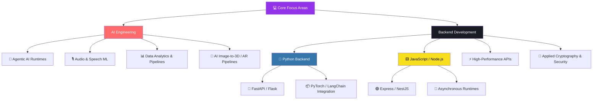

<h2 align="center">Hi 👋! My name is Rizky Pratama Putra and I'm a Beginner Developer, from Indonesia ^^</h2>

  

---

##  About Me

-  18 years old, passionate about tech and problem-solving
-  On a journey to become a **Back-End Developer** and ** AI Engineer** also explore **Artificial Intelligence**
- I love learning, tackling challenges, and turning ideas into reality

---

  
##  Currently Learning 

---

## Favorite Projects

- **[OpenDataKBB](https://opendatakbb.vercel.app/)**
   Unlocking and analyzing open data for better insights.
- **ParkiRent**
   A project focused of managing parking with IoT(Internet Of Things) with hivemq.
  - **[ParkiRent FrontEnd](https://github.com/Khorzyy/ParkirentFrontEnd)**
     A project focused on making ui for managing parking.
  - **[ParkiRent BackEnd](https://github.com/Khorzyy/ParkirentBackEnd)**
     A project focused on making api and comunicate with hivemq.

---

##  Fun Facts

🏃 I enjoy running to stay active and clear my mind  
♟️ Sometimes, I play a little bit of chess

---

  ## 📊 GitHub Stats

 

 

---

## 🗺️ 2027 Roadmap

  
---

 

<picture>
      <source
    media="(prefers-color-scheme: dark)"
      srcset="https://github.com/Khorzyy/Khorzyy/blob/output/github-snake-dark.svg"
      />
    <source
      media="(prefers-color-scheme: light)"
      srcset="https://github.com/Khorzyy/Khorzyy/blob/output/github-snake-dark.svg"
      />
    
  </picture>

---

### 🤝 Let's Build Something Together

 

**⭐️ From [Khorzyy](https://github.com/Khorzyy) — Made with 💜 in Markdown**

  <b>“Stay curious, keep learning, and never stop building!” </b>

